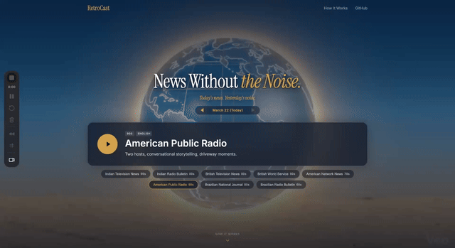

<div align="center">

# RetroCast

**Today's news. Yesterday's voice.**

Modern news is noise. RetroCast delivers today's headlines with the calm authority of vintage broadcast eras — AI-generated retro news bulletins across 4 countries and 8 styles, from 1960s Brazilian radio to 90s Indian television.

[](LICENSE)
[](https://python.org)
[](https://firecrawl.dev)
[](https://elevenlabs.io)

</div>

<div align="center">



**[Watch the demo with sound →](https://youtu.be/tZRYseBIu_0)**

</div>

---

RetroCast fetches current news via [Firecrawl](https://firecrawl.dev), writes authentic broadcast scripts with [OpenAI GPT-4o](https://openai.com), and generates period-accurate audio with [ElevenLabs](https://elevenlabs.io) — complete with era-appropriate intro/outro music, multi-voice anchoring, and a live "Ask the Anchor" call-in feature.

## Features

- **8 broadcast styles** — 4 countries (India, UK, US, Brazil) × 2 formats (TV + Radio), each with era-authentic voice, scripting, and music
- **On-demand generation** — Click play, and today's news is fetched, scripted, and narrated in real time
- **Dual-anchor broadcasts** — TV formats use two AI anchors trading stories via ElevenLabs Text-to-Dialogue
- **Fact verification** — Firecrawl cross-checks headlines before they air, flagging disputed claims
- **"Ask the Anchor"** — Live voice conversations with the AI news anchor, who can search news and fact-check in real time using ElevenLabs Conversational AI
- **Multilingual** — Hindi, English, and Portuguese broadcasts with native-speaker voices
- **Date navigation** — Browse and replay past broadcasts

## Quick Start

```bash
git clone https://github.com/pvernekar/retrocast.git
cd retrocast
pip install -r requirements.txt
cp .env.example .env         # Add your API keys
python setup.py              # Validates keys, creates ElevenLabs agent
python server.py             # http://localhost:5000
```

> **Requires [ffmpeg](https://ffmpeg.org/)** for audio assembly — `brew install ffmpeg` on macOS, `apt install ffmpeg` on Linux.

You'll need API keys from three services (all have free tiers):

| Service | What it does | Get a key |
|---------|-------------|-----------|
| [Firecrawl](https://firecrawl.dev) | Searches and extracts news articles | [firecrawl.dev](https://firecrawl.dev) |
| [OpenAI](https://openai.com) | Writes broadcast scripts (GPT-4o) | [platform.openai.com](https://platform.openai.com/api-keys) |
| [ElevenLabs](https://elevenlabs.io) | Text-to-speech and live voice agent | [elevenlabs.io](https://elevenlabs.io/app/settings/api-keys) |

## Broadcast Styles

| Style | Country | Format | Era | Language |
|-------|---------|--------|-----|----------|
| Doordarshan News | India | TV | 1990s | Hindi |
| All India Radio (Akashvani) | India | Radio | 1980s | Hindi |
| BBC Television News | UK | TV | 1980s | English |
| BBC World Service | UK | Radio | 1980s | English |
| Network News (CBS/NBC) | US | TV | 1970s | English |
| NPR Morning Edition | US | Radio | 1990s | English |
| Jornal Nacional | Brazil | TV | 1980s | Portuguese |
| Repórter Esso | Brazil | Radio | 1960s | Portuguese |

Each style has its own ElevenLabs voice (or voice pair for dual-anchor formats), scripting conventions faithful to the era, and period-appropriate intro/outro music.

## How It Works

```
  Firecrawl             Firecrawl             OpenAI              ElevenLabs
┌──────────┐         ┌──────────┐         ┌──────────┐         ┌──────────┐
│  Fetch   │────────▶│  Verify  │────────▶│  Script  │────────▶│  Audio   │
│  News    │         │  Facts   │         │  Write   │         │  Generate│
└──────────┘         └──────────┘         └──────────┘         └──────────┘
 Search 6 categories   Cross-check top      GPT-4o writes an     Text-to-Dialogue
 by country/region     stories against      era-authentic         for dual-anchor,
 via Firecrawl news    fact-check sources    broadcast script      TTS for solo, then
 search API            and flag disputes     in the target lang    merge with intro/
                                                                   outro music
```

1. **Fetch** — Firecrawl searches current news across 6 categories (politics, economy, science, sports, geopolitics, society), geo-filtered by country
2. **Verify** — Top articles are cross-checked against fact-check sources via Firecrawl; disputed claims are flagged for the anchor to address
3. **Script** — OpenAI GPT-4o writes a ~3-minute broadcast script following the style's era conventions, language, and editorial voice
4. **Generate** — ElevenLabs converts the script to speech (Text-to-Dialogue for dual-anchor TV formats, standard TTS for radio), then pydub assembles the final MP3 with intro/outro music

## Architecture

```
┌─────────────────────────────────────────────────────────────┐
│                        Browser                               │
│  ┌─────────────────────────────────────────────────────┐    │
│  │  index.html — Single-page app                        │    │
│  │  • Audio player with date navigation                 │    │
│  │  • On-demand generation (poll for progress)          │    │
│  │  • "Ask the Anchor" via ElevenLabs Conversation SDK  │    │
│  └───────────────────────┬─────────────────────────────┘    │
└──────────────────────────┼──────────────────────────────────┘
                           │ HTTP
┌──────────────────────────┼──────────────────────────────────┐
│  server.py — Flask       │                                   │
│  ├─ GET  /api/manifest   │  List available broadcasts        │
│  ├─ GET  /api/status     │  Generation progress              │
│  ├─ POST /api/generate   │  Trigger background generation    │
│  ├─ POST /api/agent/start│  Provision live call-in session   │
│  └─ POST /api/agent/tools│  Webhook tools for live agent     │
└──────────────────────────┼──────────────────────────────────┘
                           │
┌──────────────────────────┼──────────────────────────────────┐
│  retrocast.py — Core pipeline                                │
│  ├─ fetch_news()         │  Firecrawl news search API        │
│  ├─ verify_news()        │  Firecrawl fact-checking           │
│  ├─ generate_script()    │  OpenAI GPT-4o                     │
│  └─ generate_audio()     │  ElevenLabs TTS / Text-to-Dialogue │
└──────────────────────────┴──────────────────────────────────┘
```

Concurrency is handled with per-style generation locks (only one generation per style at a time) and a thread-safe manifest for tracking completed broadcasts.

## "Ask the Anchor"

After listening to a broadcast, click **"Ask the Anchor"** to start a live voice conversation with the AI news anchor. The anchor stays in character — a 1970s American news anchor will respond differently than a 1960s Brazilian radio host.

During the conversation, the anchor can:
- **Search for breaking news** via Firecrawl in real time
- **Fact-check claims** you ask about
- **Read full articles** to give deeper context
- **Research any topic** you bring up

This is powered by [ElevenLabs Conversational AI](https://elevenlabs.io/conversational-ai) with webhook tools that call back to the server's Firecrawl integration.

To enable the live tools (search, fact-check):

1. Set `AGENT_BASE_URL` in `.env` to your public URL (e.g., `https://your-app.replit.app`)
2. Re-run `python setup.py` to configure the webhook tools

Without `AGENT_BASE_URL`, the anchor can still converse but won't have access to live search.

## Environment Variables

| Variable | Required | Description |
|----------|----------|-------------|
| `FIRECRAWL_API_KEY` | Yes | Firecrawl API key |
| `OPENAI_API_KEY` | Yes | OpenAI API key |
| `ELEVENLABS_API_KEY` | Yes | ElevenLabs API key |
| `AGENT_BASE_URL` | No | Public URL for webhook tools |
| `PORT` | No | Server port (default: `5000`) |

## Deploy on Replit

1. Import this repo from GitHub
2. Add your API keys as **Secrets** (`FIRECRAWL_API_KEY`, `OPENAI_API_KEY`, `ELEVENLABS_API_KEY`)
3. Open the **Shell** tab and run `python setup.py`
4. Set `AGENT_BASE_URL` to your Replit URL (e.g., `https://retrocast.yourusername.replit.app`)
5. Click **Run**

The included `replit.nix` ensures ffmpeg is available.

## Project Structure

```
retrocast/
├── server.py            # Flask server — API endpoints, static serving, rate limiting
├── retrocast.py         # Core pipeline — news fetching, verification, script & audio generation
├── agent_config.py      # ElevenLabs Conversational AI agent setup and webhook tools
├── setup.py             # Interactive setup wizard — API key validation, agent creation
├── generate_all.py      # Batch generation script (all 8 styles at once)
├── requirements.txt     # Python dependencies
├── assets/              # Intro/outro music files for each broadcast style
├── web/
│   ├── index.html       # Single-page frontend (player, globe, conversation UI)
│   ├── favicon.svg      # Wireframe globe icon
│   └── audio/           # Generated broadcasts by date (gitignored)
├── .env.example         # Environment variable template
├── .replit              # Replit run configuration
└── replit.nix           # Replit system dependencies (Python 3.11, ffmpeg)
```

## Validation

```bash
python setup.py --check    # Validate all API keys and agent config (exit 0 = OK)
```

## Contributing

Contributions are welcome! See [CONTRIBUTING.md](CONTRIBUTING.md) for guidelines.

The most impactful contributions:
- **New countries/styles** — Add a new broadcast era (see the style guide in `.claude/commands/add-country.md`)
- **Voice improvements** — Better voice matching, pronunciation tuning
- **Frontend polish** — Animations, mobile experience, accessibility

## Security

If you discover a security vulnerability, please report it responsibly. See [SECURITY.md](SECURITY.md) for details.

## Acknowledgments

RetroCast is built on three remarkable APIs:

- **[Firecrawl](https://firecrawl.dev)** — Powers news discovery, article extraction, and live fact-checking
- **[ElevenLabs](https://elevenlabs.io)** — Powers voice generation (TTS, Text-to-Dialogue) and the live "Ask the Anchor" Conversational AI
- **[OpenAI](https://openai.com)** — Powers broadcast script writing via GPT-4o

## License

[MIT](LICENSE) — use it, fork it, broadcast it.
